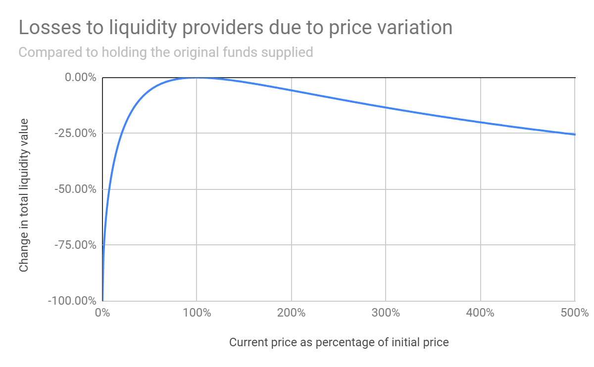

# 无常损失（Impermanent Loss）

当一名挖矿者于自动做市商（AMM）上提供流动性时，他需要以50:50的价值存入两种资产（于存款的那刻）。自动做市商被复杂的数学公式所控制，以自动调整相关资产的比例，并同时决定它们的价格。当AVAX和ETH的价格波动时，自动做市商会调整流动性挖矿者的资产比例以确保它们的价值维持于50:50。这意味着挖矿者可以失去一部分因某资产表现更好而获得的利润。

‌让我们看看以下例子，假设1ETH＝100AVAX及100AVAX＝1ETH。有一名挖矿者在一自动做市商上存入了100AVAX及1ETH以提供流动性，他同时获得了“收据”（LP）代币。接着他可以把其存于Yield Yak以自动计算复利。在此期间，AVAX的价格因愈来愈多人购买而上升，但流动资金池会自动更改比例而确保AVAX及ETH的价值比例维持于50:50。

‌由于AVAX价格急升，现在1ETH只等价于50AVAX。但因为流动资金池会自动调较于池内的代币数目，挖矿者会损失AVAX的总数。

‌这就是无常损失。如果ETH和AVAX价格波动一致，无常损失并不会出现。但如果其中一种资产的价格大幅上升或下降，挖矿者将蒙受损失。

‌在上述的例子中，如果挖矿者不在自动做市商上提供流动性而单单持有AVAX和ETH，他将可以赚取更多。

‌但是，如果挖矿者持续留于流动池内而AVAX回归原来的价值，那挖矿者的总资产价值将会返回原有数目—100 AVAX及1ETH（如果挖矿者存款于Yield Yak将会拥有更多ETH及AVAX！）。  

请仅记，无常损失仅当你移除流动性时变为永久性损失。

## 如何保护自己不受无常损失影响？

其中一个降低无常损失的机率的方法是为一对相对价格稳定的资产提供流动性。例如稳定币对如DAI-USDT，无币损失的机率和幅度相对地十分低。

‌但这些矿池的缺点是你不能赚取价格上升的利润。而且这些矿池的数目十分少并且未必有如其他矿池般高的回报。

